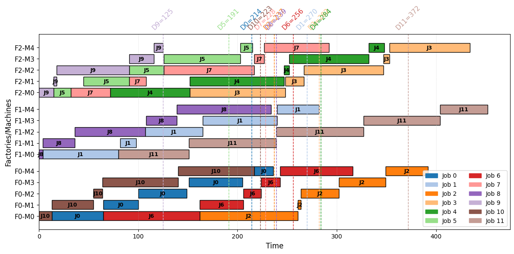

# Distributed Permutation Flow-shop Scheduling Problem with Due Dates (DPFSPDD)

---

This repository contains:

* The implementation, using Google ORTools CPSAT, of the Constraint Programming model described in the paper entitled: "New results for the distributed permutation flowshop scheduling problem with due dates" (submitted to the International Journal of Production Research).
  * [Notebook (solve I_3_12_5_4.txt problem and display solution)](./dpfspdd.ipynb)
* Datasets ([SMALL](./datasets/small/)/[LARGE](./datasets/large/))
* Results
  * [Tables with new best known results vs. results from the bibliography](./tables_bkr_vs_pbkr.md)
  * [Best known results for the SMALL dataset (csv)](./best_results_small.csv)
  * [Best known results for the LARGE dataset (csv)](./best_results_large.csv)
